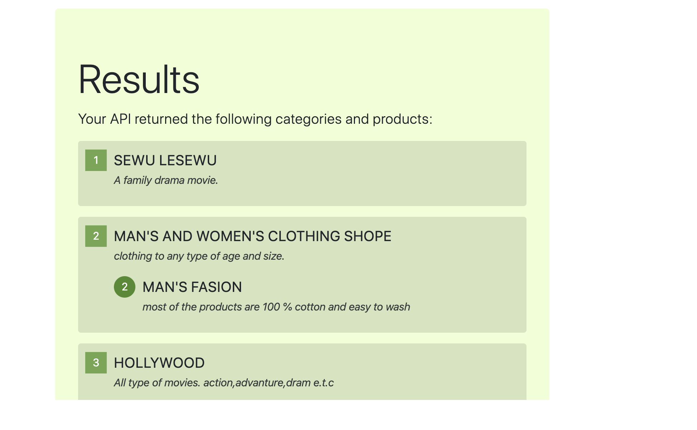

# HTTP-lab-06

## Project Name : Lab 06 — HTTP and REST

### Author: Henok Gebremedhn

### Links and Resources

- [submission PR](https://github.com/henok-401-javascript/HTTP-lab-06/pull/1)

### DOCUMENTATION 
[Swagger Hub](https://app.swaggerhub.com/apis-docs/henokLwi/default-title/0.1)

### Setup

#### `.env` requirements (where applicable)

- `PORT` - json-server --watch ./data/db.json

#### How to initialize/run your application (where applicable)

 * json-server --watch ./data/db.json
 * EndPoint:'/1'
      return By Id of 1.
 * EndPoing:'/categorySchema'
      return by all the categoryListed from the inventory. 
 * EndPoing:'/productsSchema'      
      return by all the productsSchema from the inventory.

#### Tests

* unit tests: 'npm test'
* lint test: 'npm run lint'

#### UML

